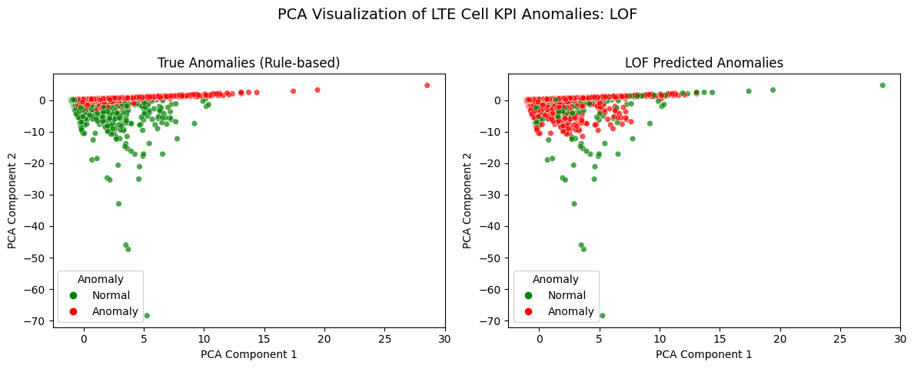
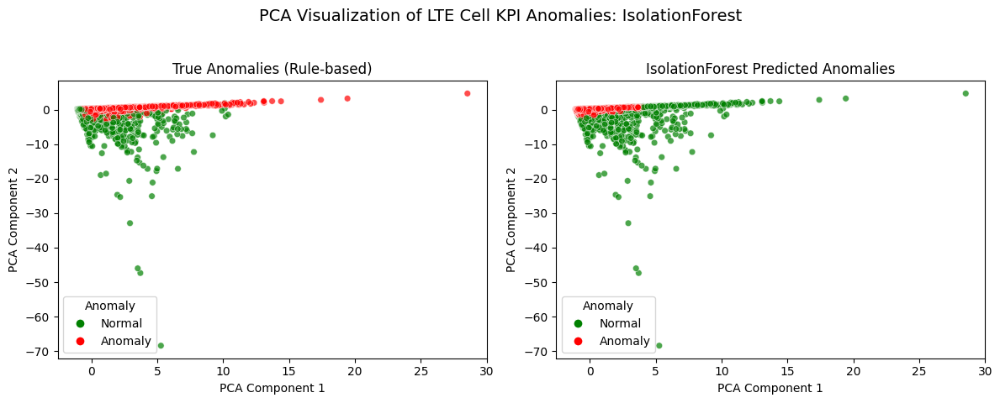

# 4G LTE Cell KPI Unsupervised Anomaly Detection

This project is designed for **students and telecom engineers** who want to explore and apply unsupervised anomaly detection on LTE cell performance data. The pipeline helps you identify 4G cells that behave abnormally, using all relevant features collected from 4G network management systems—including RRC and ERAB success rates, as well as uplink and downlink throughput.

## Why This Project?

In real-world telecom networks, it's difficult to label anomalies in advance because there are many features and complex relationships. This project lets you **statistically learn what is "anomalous"** from the data itself, so that domain experts can focus their troubleshooting efforts on the most suspicious cells.

---

## Features

- **Data Cleaning & Encoding:**  
  Cleans raw anonymized Excel data, extracts and encodes eNodeB IDs, and saves a ready-to-use CSV.
- **Unsupervised Anomaly Detection:**  
  Compares Local Outlier Factor (LOF), Isolation Forest, and One-Class SVM.
- **Operator Rule-Based Evaluation:**  
  Uses thresholds:  
  - RRC_Success_Rate < 95.0%  
  - ERAB_Success_Rate < 96.0%  
  - UL_TP < 100,000  
  - DL_TP < 750,000  
  to define "true" anomalies for evaluation. These can be adjusted to fit your network.
- **Metrics & Visualization:**  
  Computes precision, recall, F1-score, and provides clear PCA-based visualizations with labeled axes and legends.
- **Modular Code:**  
  Each step (cleaning, modeling, evaluation, plotting) is a separate function for easy reuse and extension.

---

## Getting Started

### 1. Data Preparation

- Place your raw Excel file (e.g., `Aug01-31.xlsx`) in the project directory.
- Run the cleaning script to generate `encoded_enodeb_rrc_success.csv`:

```python
from anomaly_detection_pipeline import load_and_clean_data
load_and_clean_data('Aug01-31.xlsx')
```

This will:
- Extract relevant columns, including uplink and downlink throughput
- Clean and encode eNodeB IDs
- Convert KPIs to numeric
- Save the cleaned CSV

### 2. Anomaly Detection Pipeline

Run the main pipeline:

```bash
python anomaly_detection_pipeline.py
```

Or, if using Jupyter/VSCode, run the notebook cells.

---

## Pipeline Overview

1. **Load Data:**  
   Reads the cleaned CSV with columns:  
   `Date`, `eNodeB ID`, `eNodeB ID Encoded`, `RRC_Success_Rate`, `ERAB_Success_Rate`, `UL_TP`, `DL_TP`

2. **Preprocess Data:**  
   - Drops rows with missing KPI values
   - Standardizes features

3. **Model Definition:**  
   - LOF (`novelty=True`, `contamination=0.05`)
   - Isolation Forest (`contamination=0.05`)
   - One-Class SVM (`nu=0.05`)

4. **Fit & Predict:**  
   - Trains each model on the same feature set
   - Predicts anomalies (1=anomaly, 0=normal)

5. **Rule-Based Labeling:**  
   - Flags as anomaly if any KPI is below its threshold

6. **Evaluation:**  
   - Prints precision, recall, F1-score, and classification report for each model

7. **Visualization:**  
   - PCA scatter plots show true vs. predicted anomalies  
   - All axes and legends are clearly labeled for interpretability

8. **Model Recommendation:**  
   - The model with the highest F1-score is recommended

---

## Example Output

- **Evaluation Metrics:**  
  ```
  LOF: Precision=0.85, Recall=0.78, F1=0.81
  ...
  Recommended model: IsolationForest (F1=0.83)
  ```

- **Visualization:**  
  Example PCA plots for each model (located in the same folder):

  
  
  

  *(PCA plots show separation of normal and anomalous points with clear axis labels and legends.  
  **PCA Component 1** and **PCA Component 2** are new variables created by combining the original features to capture the most variance in the data, making it easier to visualize clusters and anomalies.)*

---

## Using the Selected Model for Anomaly Prediction

After running the pipeline, the model with the highest F1-score will be recommended. To use this model for future anomaly prediction:

1. **Train the model** on your historical data using the pipeline.
2. **Save the trained model** using `joblib` or `pickle` (add this step to your code if needed).
3. **For new data**:
   - Clean and preprocess the data using the same steps (scaling, feature selection).
   - Load the saved model and scaler.
   - Use `model.predict(X_new)` to get anomaly predictions (1=anomaly, 0=normal).
4. **Investigate flagged anomalies** for further domain-specific troubleshooting.

---

## Requirements

- Python 3.8+
- pandas
- numpy
- scikit-learn
- matplotlib
- seaborn

Install with:

```bash
pip install pandas numpy scikit-learn matplotlib seaborn
```

---

## File Structure

```
.
├── anomaly_detection_pipeline.py
├── encoded_enodeb_rrc_success.csv
├── Aug01-31.xlsx
├── README.md
├── pca_lof.png
├── pca_if.png
├── pca_svm.png
```

---

## Notes

- The pipeline is fully modular: you can swap in new models or features easily.
- All plots are self-explanatory, with labeled axes and legends.
- The code is robust to missing values and will only use valid rows for modeling.
- **Remember:** Since it's hard to label anomalies with so many features, this pipeline helps you learn statistically significant anomalies from your data, so domain experts can focus on what matters most.

---

## License

MIT License

---

## Contact

For questions or suggestions, please open an issue or contact beneyam.berehanu@aau.edu.et